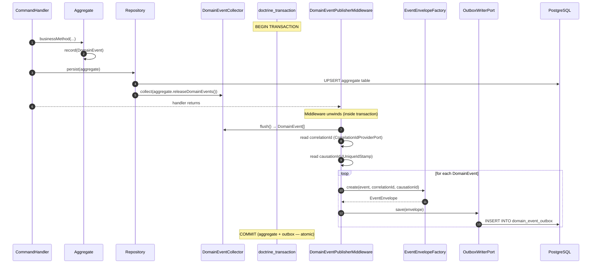
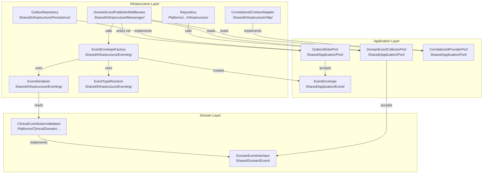
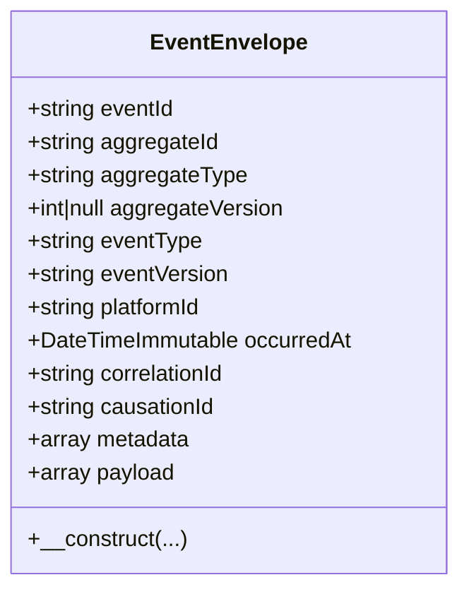
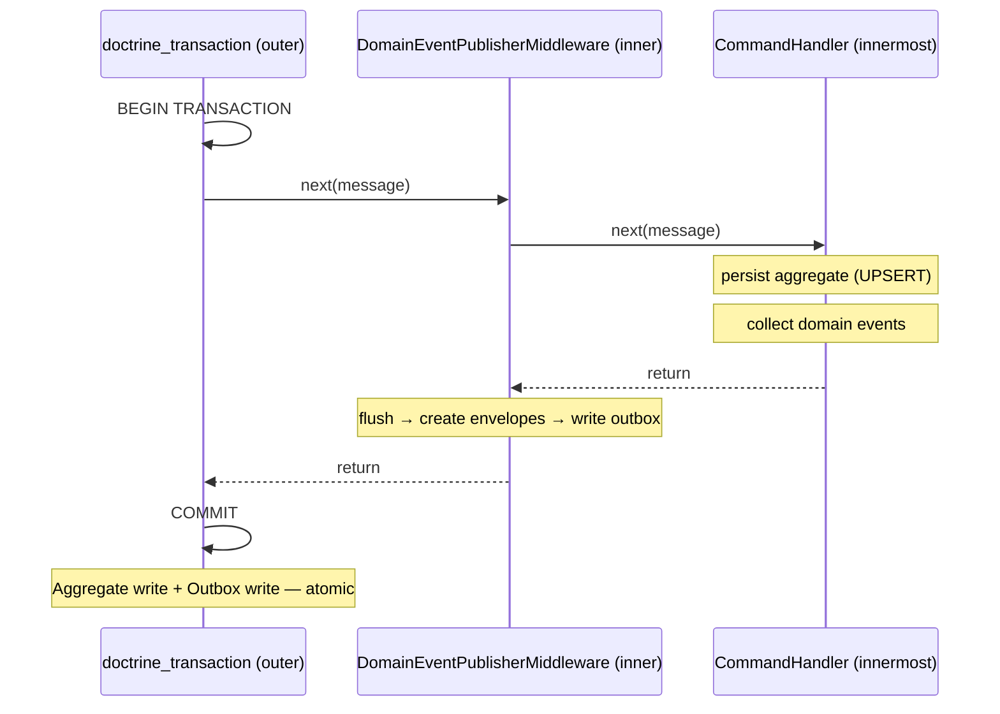
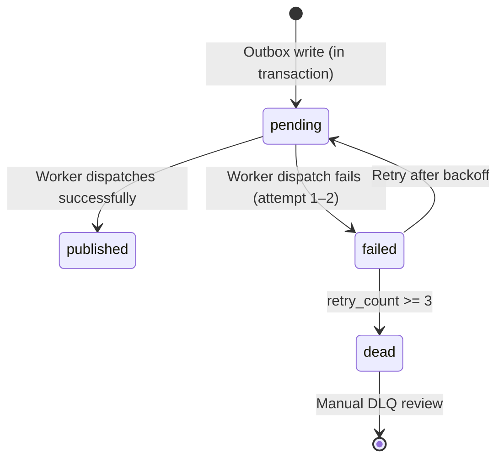
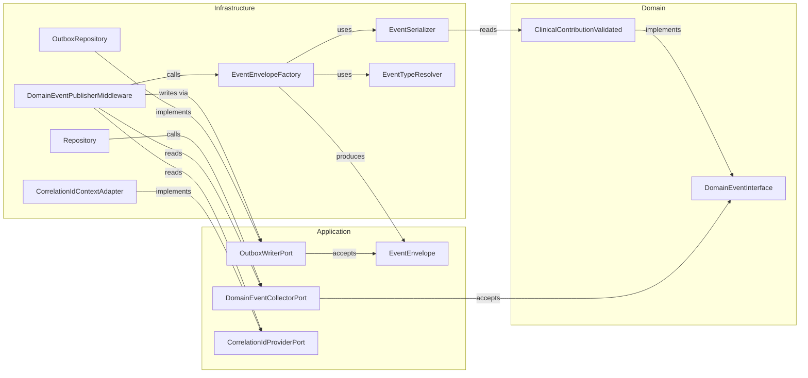
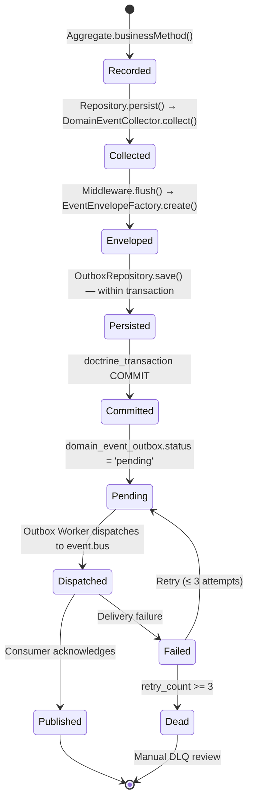

# ADR-SA-013 — Domain Event Publication & Outbox Pattern

**Document ID**: ADR-SA-013  
**Title**: Domain Event Publication & Outbox Pattern  
**Status**: Accepted  
**Supersedes**: Outbox schema defined in ADR-SA-010 (§4)  
**Date**: 2026-07-25  

---

## 1. Metadata

| Field | Value |
|---|---|
| Authors | Architecture Committee |
| Process | AC-001.1 · AC-001.2 · AC-001.3 |
| Scope | All business platforms — Clinical, Identity, Scheduling, and future |
| Enforcement | Mandatory. No variance permitted without a superseding ADR. |

---

## 2. Context

MedLink is a modular monolith built on Domain-Driven Design, Hexagonal Architecture, CQRS, and Event-Driven Architecture.

The reliable delivery of Domain Events is a foundational guarantee: every business state transition recorded by an Aggregate must be durably communicated to downstream consumers (Projectors, Integration Event translators, notification systems). A lost Domain Event creates a desynchronised Read Model and, in a clinical context, a potential loss of critical medical information.

This document defines the complete publication pipeline, from the moment an Aggregate records a Domain Event to the moment a Symfony Messenger consumer processes it. It replaces all earlier informal specifications and resolves the conflicts identified between PR-004 and ADR-SA-010 (§4).

### Driving Constraints

| Constraint | Source |
|---|---|
| Domain has zero knowledge of transport | CLAUDE.md — Core Principle |
| Application Layer does not depend on Infrastructure | ADR-0003 |
| Repositories do not publish events | ADR-SA-007 D-002 |
| Transaction ownership belongs to the Application Layer | ADR-SA-007 D-003 |
| At-least-once delivery required | ADR-SA-010 |
| DBAL only — no Doctrine ORM | ADR-SA-009 |

---

## 3. Problem Statement

Before this ADR, three questions were unresolved:

**P-001 — Where does DomainEvent become EventEnvelope?**  
No document specified which component is responsible for the transformation and at which architectural layer it occurs.

**P-002 — Atomicity of Aggregate persistence and Outbox write**  
Without a specified mechanism, the Aggregate write and the Outbox write could execute in separate transactions, risking event loss on failure between the two operations.

**P-003 — Dependency chain violating Hexagonal Architecture**  
Early proposals placed EventEnvelopeFactory in the Application Layer, creating a dependency Application → Infrastructure. Others placed Outbox writing in the Repository, violating ADR-SA-007 D-002.

This ADR resolves all three.

---

## 4. Decision

This section is normative. All clauses use RFC 2119 keywords.

### 4.1 Domain Events

**R-001** Domain Events MUST implement `DomainEventInterface` (`Shared/Domain/Event/DomainEventInterface.php`).

**R-002** Domain Events MUST NOT reference any class from the Application or Infrastructure layers.

**R-003** Domain Events MUST NOT contain serialization logic, transport metadata, or persistence identifiers.

**R-004** Domain Events MUST be immutable. No setters. No mutation methods.

**R-005** A Domain Event MUST carry only the data necessary to describe the business fact. No technical metadata (correlation IDs, envelope IDs, platform names) belongs in a Domain Event.

**R-005a** `Aggregate::releaseDomainEvents()` MUST return all Domain Events recorded since the previous release, preserving FIFO order. The internal event collection MUST be cleared immediately after the call. A subsequent invocation without newly recorded events MUST return an empty collection.

> **Rationale:** The verb "release" expresses the Aggregate relinquishing ownership of its recorded Domain Events after persistence. Unlike "pull", it describes the business intent rather than the technical mechanism. This naming improves readability while remaining implementation-agnostic.

### 4.2 DomainEventCollector

**R-006** The Repository MUST call `DomainEventCollectorPort::collect()` with the events returned by `Aggregate::releaseDomainEvents()` immediately after persisting the Aggregate.

**R-007** `DomainEventCollectorPort` MUST be defined in the Application Layer (`Shared/Application/Port/`).

**R-008** `DomainEventCollectorPort` MUST accept `DomainEventInterface` parameters, not concrete domain event classes.

### 4.3 Repository

**R-009** The Repository MUST persist the Aggregate using a DBAL UPSERT (`ON CONFLICT DO UPDATE`).

**R-010** The Repository MUST call `DomainEventCollectorPort::collect()` as the final operation before returning.

**R-011** The Repository MUST NOT write to the `domain_event_outbox` table.

**R-012** The Repository MUST NOT dispatch to any Messenger bus.

**R-013** The Repository MUST NOT own transaction boundaries. It participates in the active transaction opened by `doctrine_transaction` middleware.

### 4.4 DomainEventPublisherMiddleware

**R-014** `DomainEventPublisherMiddleware` MUST be registered on `command.bus` as an inner middleware, inside `doctrine_transaction`.

**R-015** `DomainEventPublisherMiddleware` MUST flush `DomainEventCollectorPort` after the command handler returns.

**R-016** `DomainEventPublisherMiddleware` MUST call `EventEnvelopeFactory::create()` for each collected event.

**R-017** `DomainEventPublisherMiddleware` MUST write all resulting `EventEnvelope` objects to `OutboxWriterPort` before returning control to `doctrine_transaction`.

**R-018** `DomainEventPublisherMiddleware` MUST read `correlationId` from `CorrelationIdProviderPort`.

**R-019** `DomainEventPublisherMiddleware` MUST read `causationId` from the `UniqueIdStamp` of the Symfony Messenger `Envelope`. If no stamp is present, it MUST generate a UUID v4.

**R-020** The Aggregate write and the Outbox write MUST occur in the same PostgreSQL transaction. No exception.

### 4.5 EventEnvelope

**R-021** `EventEnvelope` MUST be defined in `Shared/Application/Event/EventEnvelope.php`.

**R-022** `EventEnvelope` MUST be immutable. No setters. No `with*()` methods.

**R-023** `EventEnvelope` MUST NOT contain any business domain concept. No `patientId`, `careRecordId`, `practitionerId` as first-class fields.

**R-024** `EventEnvelope` MUST NOT contain any transport protocol property (topic name, routing key, queue name, TTL, priority).

**R-025** `EventEnvelope.aggregateVersion` MUST be `null` for the MVP. It SHALL NOT be populated until a concrete requirement for optimistic locking or strict stream ordering is documented in a superseding ADR.

**R-026** `EventEnvelope` fields are defined in §5.3.

### 4.6 EventEnvelopeFactory

**R-027** `EventEnvelopeFactory` MUST be defined in `Shared/Infrastructure/Eventing/EventEnvelopeFactory.php`.

**R-028** `EventEnvelopeFactory` MUST NOT fetch `correlationId` or `causationId` internally. Both MUST be received as method parameters from `DomainEventPublisherMiddleware`.

**R-029** `EventEnvelopeFactory` MUST use `EventSerializer` for payload serialization. Direct `json_encode` on a Domain Event object is forbidden.

**R-030** `EventEnvelopeFactory` MUST use `EventTypeResolver` to determine `eventType`. Using the PHP class name directly as `eventType` is forbidden.

**R-031** `EventEnvelopeFactory` MUST set `occurredAt` from `DomainEvent::occurredAt()`. The current wall-clock time MUST NOT be used.

### 4.7 EventSerializer

**R-032** `EventSerializer` MUST be defined in `Shared/Infrastructure/Eventing/EventSerializer.php`.

**R-033** `EventSerializer` MUST produce an explicit `array` mapping from each Domain Event class. Reflective or generic serialization is forbidden.

**R-034** `EventSerializer` MUST NOT use PHP `serialize()` or `unserialize()`.

**R-035** Each serialized schema MUST be versioned. The version string is included in the `EventEnvelope.eventVersion` field.

### 4.8 EventTypeResolver

**R-036** `EventTypeResolver` MUST be defined in `Shared/Infrastructure/Eventing/EventTypeResolver.php`.

**R-037** Event type strings MUST follow the pattern: `{platform}.{aggregate}.{past_tense_verb}`. Examples: `clinical.contribution.validated`, `clinical.contribution.approved`.

**R-038** The mapping from PHP class to event type string MUST be declared in an explicit configuration map. Derivation from class names or namespaces is forbidden.

**R-039** Event type strings MUST be stable. Renaming a PHP class MUST NOT change the event type string.

### 4.9 OutboxRepository

**R-040** `OutboxWriterPort` MUST be defined in `Shared/Application/Port/OutboxWriterPort.php`.

**R-041** `OutboxRepository` MUST implement `OutboxWriterPort` and MUST be defined in `Shared/Infrastructure/Persistence/OutboxRepository.php`.

**R-042** `OutboxRepository` MUST insert using `ON CONFLICT (event_id) DO NOTHING`. Duplicate event writes MUST be silently ignored.

**R-043** `OutboxRepository` MUST NOT publish to any Messenger bus.

### 4.10 CorrelationId

**R-044** `CorrelationIdProviderPort` MUST be defined in `Shared/Application/Port/CorrelationIdProviderPort.php`.

**R-045** The HTTP adapter MUST generate a UUID v4 at the start of each HTTP request and store it in `CorrelationContext`. If the incoming request carries an `X-Correlation-ID` header, that value MUST be used instead.

**R-046** The fallback adapter (console commands, background workers) MUST generate a fresh UUID v4 per process execution.

**R-047** `correlationId` MUST NOT be null in any `EventEnvelope` reaching the Outbox.

### 4.11 Outbox Worker

**R-048** The Outbox Worker MUST read from `domain_event_outbox` where `status = 'pending'`, ordered by `occurred_at ASC, id ASC`.

**R-049** The Outbox Worker MUST dispatch each `EventEnvelope` to `event.bus`.

**R-050** The Outbox Worker MUST update `status = 'published'` and `published_at = NOW()` only after successful dispatch confirmation.

**R-051** On dispatch failure, the Worker MUST increment `retry_count` and set `status = 'failed'`. After three failures, it MUST set `status = 'dead'`.

**R-052** Downstream consumers MUST be idempotent. `EventEnvelope.eventId` MUST be used as the idempotency key.

---

## 5. Architecture

### 5.1 Pipeline Overview



### 5.2 Layer Dependency Graph



### 5.3 EventEnvelope Schema



| Field | Type | Source | MVP Value |
|---|---|---|---|
| `eventId` | `string` (UUID v4) | Generated by EventEnvelopeFactory | Required |
| `aggregateId` | `string` (UUID) | Read from DomainEvent | Required |
| `aggregateType` | `string` | EventTypeResolver | Required |
| `aggregateVersion` | `int\|null` | Not populated | `null` |
| `eventType` | `string` | EventTypeResolver config map | Required |
| `eventVersion` | `string` | EventSerializer static constant | `"1.0"` |
| `platformId` | `string` | Factory constructor injection | Required |
| `occurredAt` | `DateTimeImmutable` | Copied from DomainEvent | Required |
| `correlationId` | `string` (UUID) | CorrelationIdProviderPort | Required |
| `causationId` | `string` (UUID) | UniqueIdStamp or generated | Required |
| `metadata` | `array` | Empty for MVP | `[]` |
| `payload` | `array` | EventSerializer output | Required |

### 5.4 Outbox Table Schema

```sql
CREATE TABLE domain_event_outbox (
    id              UUID         NOT NULL DEFAULT gen_random_uuid(),
    event_id        UUID         NOT NULL,
    aggregate_id    UUID         NOT NULL,
    aggregate_type  VARCHAR(255) NOT NULL,
    aggregate_version INT        DEFAULT NULL,
    event_type      VARCHAR(255) NOT NULL,
    event_version   VARCHAR(20)  NOT NULL DEFAULT '1.0',
    platform        VARCHAR(100) NOT NULL,
    payload         JSONB        NOT NULL,
    metadata        JSONB        NOT NULL DEFAULT '{}',
    correlation_id  UUID         NOT NULL,
    causation_id    UUID         NOT NULL,
    occurred_at     TIMESTAMPTZ  NOT NULL,
    status          VARCHAR(20)  NOT NULL DEFAULT 'pending',
    retry_count     SMALLINT     NOT NULL DEFAULT 0,
    published_at    TIMESTAMPTZ  DEFAULT NULL,
    created_at      TIMESTAMPTZ  NOT NULL DEFAULT NOW(),

    PRIMARY KEY (id),
    CONSTRAINT uq_outbox_event_id UNIQUE (event_id)
);

CREATE INDEX idx_outbox_status_occurred  ON domain_event_outbox (status, occurred_at ASC);
CREATE INDEX idx_outbox_aggregate        ON domain_event_outbox (aggregate_id, aggregate_type);
CREATE INDEX idx_outbox_correlation      ON domain_event_outbox (correlation_id);
CREATE INDEX idx_outbox_platform_type    ON domain_event_outbox (platform, event_type);
```

> **Note:** This schema supersedes the `domain_event_outbox` schema defined in ADR-SA-010 §4. ADR-SA-010 remains authoritative for delivery guarantees (at-least-once, retry policy, DLQ). This document is authoritative for the table schema and EventEnvelope structure.

### 5.5 Transaction Boundary



> **Invariant:** The Outbox write always occurs before `COMMIT`. There is no window between a committed Aggregate state and an unwritten Outbox entry.

### 5.6 Outbox Worker Lifecycle



| Status | Meaning | Next action |
|---|---|---|
| `pending` | Written, not yet dispatched | Worker picks up |
| `published` | Dispatched successfully | No action |
| `failed` | Dispatch failed, retries remaining | Worker retries with backoff |
| `dead` | Max retries exceeded | Manual DLQ review |

---

## 6. Component Responsibilities

### 6.1 DomainEventInterface

| Attribute | Value |
|---|---|
| Location | `Shared/Domain/Event/DomainEventInterface.php` |
| Layer | Domain |

**Responsibility:** Marker interface that identifies an object as a Domain Event. Enables the Application Layer to collect and process Domain Events without depending on concrete platform classes.

**Dependencies:** None.

**Invariants:**
- Zero methods.
- Zero properties.
- Pure marker only.

> **Rationale:** Without this interface, `DomainEventCollectorPort` would need to accept `object`, losing type safety, or accept the concrete Application-layer `DomainEvent` base class, forcing Domain classes to depend on the Application Layer — a direct violation of Hexagonal Architecture.

---

### 6.2 Domain Event (concrete)

| Attribute | Value |
|---|---|
| Location | `Platforms/{Platform}/Domain/{Aggregate}/Event/` |
| Layer | Domain |

**Responsibility:** Immutable record of a business fact. Carries only the data necessary to describe what happened.

**Dependencies:** `DomainEventInterface` (same layer). Domain Value Objects only.

**Invariants:**
- No Infrastructure imports.
- No Application imports (except `DomainEventInterface` which is Domain layer).
- Immutable. Constructor-only initialization.
- `occurredAt: DateTimeImmutable` is required on every event.

> **Anti-pattern:** Adding `eventId`, `correlationId`, `platformId`, or `version` to a Domain Event is forbidden. These are transport concerns, not business facts.

---

### 6.3 DomainEventCollector

| Attribute | Value |
|---|---|
| Port location | `Shared/Application/Port/DomainEventCollectorPort.php` |
| Adapter location | `Shared/Infrastructure/Messenger/DomainEventCollector.php` |
| Layer | Port: Application · Adapter: Infrastructure |

**Responsibility:** Holds Domain Events between the Repository call and the Middleware flush. Decouples the Repository from the Middleware without introducing a direct dependency.

**Port interface:**
```php
interface DomainEventCollectorPort
{
    public function collect(DomainEventInterface ...$events): void;

    /** @return DomainEventInterface[] */
    public function flush(): array;
}
```

**Dependencies (port):** `DomainEventInterface` (Domain layer).

**Invariants:**
- `flush()` MUST clear the internal collection. A second call to `flush()` returns an empty array.
- Events are returned in collection order (FIFO).
- The Collector is request-scoped (Symfony service scope: `request` or `prototype` per command).

---

### 6.4 Repository

| Attribute | Value |
|---|---|
| Location | `Platforms/{Platform}/Infrastructure/Persistence/Repository/` |
| Layer | Infrastructure |

**Responsibility:** Persist and retrieve a single Aggregate Root. Delegate event collection to `DomainEventCollectorPort`.

**Dependencies:** DBAL `Connection`, Mapper, `DomainEventCollectorPort`.

**Invariants:**
- One Repository per Aggregate Root.
- UPSERT mandatory (`ON CONFLICT DO UPDATE`).
- MUST call `collect(aggregate.releaseDomainEvents())` after every successful write.
- MUST NOT access `domain_event_outbox`.
- MUST NOT dispatch to any Messenger bus.
- MUST NOT call `EventEnvelopeFactory`.

> **Anti-pattern:**
> ```php
> // FORBIDDEN — Repository writing to Outbox
> $this->outboxRepository->save($envelope);
> 
> // FORBIDDEN — Repository dispatching events
> $this->eventBus->dispatch(new DomainEventMessage($event));
> ```

---

### 6.5 DomainEventPublisherMiddleware

| Attribute | Value |
|---|---|
| Location | `Shared/Infrastructure/Messenger/DomainEventPublisherMiddleware.php` |
| Layer | Infrastructure |
| Bus | `command.bus` only |
| Position | Inner — inside `doctrine_transaction` |

**Responsibility:** Orchestrates the complete pipeline: collect → create envelopes → write Outbox. This is the single component that transforms Domain Events into persisted EventEnvelopes.

**Dependencies:**
- `DomainEventCollectorPort` (Application Port)
- `EventEnvelopeFactory` (Infrastructure)
- `OutboxWriterPort` (Application Port)
- `CorrelationIdProviderPort` (Application Port)
- `Symfony\Component\Messenger\Middleware\MiddlewareInterface`

**Invariants:**
- Runs after the command handler (during stack unwinding).
- Runs before `doctrine_transaction` commits.
- Processes ALL collected events atomically.
- On exception thrown by any envelope operation, the exception MUST propagate and the transaction MUST roll back.

**Messenger bus configuration:**
```yaml
# config/packages/messenger.yaml
command.bus:
    middleware:
        - doctrine_transaction          # OUTER — opens and commits transaction
        - App\Shared\Infrastructure\Messenger\DomainEventPublisherMiddleware  # INNER
```

> **Critical:** The order `doctrine_transaction` (outer) → `DomainEventPublisherMiddleware` (inner) is mandatory. Reversing the order breaks atomicity.

---

### 6.6 EventEnvelope

| Attribute | Value |
|---|---|
| Location | `Shared/Application/Event/EventEnvelope.php` |
| Layer | Application |

**Responsibility:** Immutable transport contract. Represents the technical form of a Domain Event for storage and delivery. Transport-protocol-agnostic.

**Dependencies:** PHP primitives only.

**Invariants:**
- No setters. No `with*()` methods.
- All fields set in constructor.
- No business logic. No domain methods.
- No transport-specific fields (topic, routing key, TTL, priority).
- `aggregateVersion` is `null` for the MVP.

---

### 6.7 EventEnvelopeFactory

| Attribute | Value |
|---|---|
| Location | `Shared/Infrastructure/Eventing/EventEnvelopeFactory.php` |
| Layer | Infrastructure |

**Responsibility:** Creates an `EventEnvelope` from a `DomainEventInterface` and the metadata provided by the Middleware.

**Dependencies:**
- `EventSerializer` (Infrastructure — injected)
- `EventTypeResolver` (Infrastructure — injected)
- `Symfony\Component\Uid\Uuid` (for `eventId` generation)
- `string $platformId` (constructor argument, configured per platform)

**Method signature:**
```php
public function create(
    DomainEventInterface $event,
    string $correlationId,
    string $causationId,
): EventEnvelope
```

**Invariants:**
- `correlationId` and `causationId` are ALWAYS received as parameters. Never fetched internally.
- `occurredAt` is always copied from the Domain Event. Never set to `now()`.
- Generates a fresh UUID v4 for `eventId` on every call.
- `aggregateVersion` is always `null` until ADR supersedes this decision.

---

### 6.8 EventSerializer

| Attribute | Value |
|---|---|
| Location | `Shared/Infrastructure/Eventing/EventSerializer.php` |
| Layer | Infrastructure |

**Responsibility:** Converts a concrete Domain Event to a JSON-safe `array` for the `payload` field of `EventEnvelope`.

**Dependencies:** Concrete Domain Event classes (Domain layer — Infrastructure → Domain is legal).

**Method signature:**
```php
/** @return array<string, mixed> */
public function serialize(DomainEventInterface $event): array;
```

**Invariants:**
- Explicit field mapping per event class. No reflection-based serialization.
- PHP `serialize()` / `unserialize()` are forbidden.
- Each mapping carries a `version` field that matches `EventEnvelope.eventVersion`.
- Adding a field to a Domain Event requires a corresponding update in `EventSerializer` and a version increment.

> **Rationale:** Explicit mapping ensures schema stability across PHP version upgrades, class renames, and namespace changes. Generic serialization creates hidden coupling between the PHP internal representation and the stored format.

---

### 6.9 OutboxRepository

| Attribute | Value |
|---|---|
| Port location | `Shared/Application/Port/OutboxWriterPort.php` |
| Adapter location | `Shared/Infrastructure/Persistence/OutboxRepository.php` |
| Layer | Port: Application · Adapter: Infrastructure |

**Responsibility:** Persists `EventEnvelope` objects to `domain_event_outbox`. Provides the read interface for the Outbox Worker.

**Port interface (write side):**
```php
interface OutboxWriterPort
{
    public function save(EventEnvelope $envelope): void;
}
```

**Dependencies (adapter):** DBAL `Connection`, `EventEnvelope` (Application).

**Invariants:**
- `save()` uses `ON CONFLICT (event_id) DO NOTHING` — idempotent writes.
- MUST NOT dispatch to any Messenger bus.
- The adapter participates in the active transaction. It MUST NOT call `beginTransaction()` or `commit()`.

---

### 6.10 Outbox Worker (Messenger)

| Attribute | Value |
|---|---|
| Location | `Shared/Infrastructure/Messenger/OutboxWorkerCommand.php` |
| Layer | Infrastructure |

**Responsibility:** Polls `domain_event_outbox` for `pending` records, dispatches to `event.bus`, updates delivery status.

**Dependencies:** DBAL `Connection` (direct — no Repository abstraction needed for Worker reads), `MessageBusInterface` (`event.bus`).

**Invariants:**
- Processes events in strict order: `ORDER BY occurred_at ASC, id ASC`.
- Marks `published` only after confirmed dispatch.
- Downstream consumers MUST use `eventId` as idempotency key.
- Retry policy: attempts 1–3 with exponential backoff (30s, 5min, 30min). After 3 failures: `status = 'dead'`.

---

## 7. Dependency Rules

### 7.1 Allowed and Forbidden Dependencies

| From \ To | Domain | Application | Infrastructure | Vendor |
|---|---|---|---|---|
| **Domain** | ✅ | ❌ FORBIDDEN | ❌ FORBIDDEN | ⚠️ Primitives only |
| **Application** | ✅ | ✅ | ❌ FORBIDDEN | ⚠️ Interfaces only |
| **Infrastructure** | ✅ | ✅ | ✅ | ✅ |

### 7.2 Per-Component Dependency Matrix

| Component | Layer | Depends on Domain | Depends on Application | Depends on Infrastructure |
|---|---|---|---|---|
| `DomainEventInterface` | Domain | — | ❌ | ❌ |
| `ClinicalContributionValidated` | Domain | ✅ (Value Objects) | ❌ | ❌ |
| `EventEnvelope` | Application | ❌ | ✅ (self) | ❌ |
| `DomainEventCollectorPort` | Application | ✅ (DomainEventInterface) | ✅ (self) | ❌ |
| `OutboxWriterPort` | Application | ❌ | ✅ (EventEnvelope) | ❌ |
| `CorrelationIdProviderPort` | Application | ❌ | ✅ (self) | ❌ |
| `Repository` | Infrastructure | ✅ (Aggregate) | ✅ (Port) | ✅ (DBAL) |
| `DomainEventPublisherMiddleware` | Infrastructure | ❌ | ✅ (Ports) | ✅ (Factory) |
| `EventEnvelopeFactory` | Infrastructure | ✅ (DomainEventInterface) | ✅ (EventEnvelope) | ✅ (Serializer, Resolver) |
| `EventSerializer` | Infrastructure | ✅ (concrete events) | ❌ | ✅ (self) |
| `EventTypeResolver` | Infrastructure | ❌ | ❌ | ✅ (config) |
| `OutboxRepository` | Infrastructure | ❌ | ✅ (Port, EventEnvelope) | ✅ (DBAL) |
| `CorrelationIdContextAdapter` | Infrastructure | ❌ | ✅ (Port) | ✅ (RequestStack) |

### 7.3 Verified Dependency Graph



> **Verification:** All arrows point downward (Domain ← Application ← Infrastructure) or horizontally within the same layer. No upward dependencies exist.

---

## 8. Event Lifecycle

### 8.1 Complete Lifecycle



### 8.2 Lifecycle Phases

| Phase | Owner | Transactional | Reversible |
|---|---|---|---|
| Recorded | Aggregate (Domain) | In command transaction | No — event is produced |
| Collected | Repository + DomainEventCollector | In command transaction | No |
| Enveloped | DomainEventPublisherMiddleware + EventEnvelopeFactory | In command transaction | Yes — on exception, rolls back |
| Persisted | OutboxRepository | In command transaction | Yes — on ROLLBACK |
| Committed | doctrine_transaction | — | No |
| Dispatched | Outbox Worker | Outside command transaction | Yes — Worker retries |
| Published | Messenger + Consumer | Consumer-side transaction | Consumer responsible |

### 8.3 Failure Scenarios

| Failure | Point | Effect | Recovery |
|---|---|---|---|
| Exception in CommandHandler | During handler | ROLLBACK — no Outbox write | Command fails cleanly |
| Exception in EventEnvelopeFactory | After handler, before COMMIT | ROLLBACK — no Outbox write | Command fails cleanly |
| Exception in OutboxRepository.save() | After envelopes created | ROLLBACK — no Aggregate write | Command fails cleanly |
| Process crash after COMMIT | After COMMIT | Outbox entries remain `pending` | Worker picks up on restart |
| Worker dispatch failure | During Worker | `status = 'failed'`, retries | Exponential backoff, DLQ at max |

> **Key invariant:** Because the Aggregate write and the Outbox write are atomic, there is no state where an Aggregate is committed but its events are lost. Either both commit or both roll back.

---

## 9. Rejected Alternatives

### 9.1 Option A — Application Service Orchestrates the Pipeline

**Description:** The `CommandHandler` directly calls `EventEnvelopeFactory` and `OutboxRepository` after persisting the Aggregate.

**Rejected because:**

| Reason | Principle violated |
|---|---|
| CommandHandler depends on `EventEnvelopeFactory` (Infrastructure) | Application MUST NOT depend on Infrastructure (ADR-0003) |
| CommandHandler depends on `OutboxRepository` port for infrastructure delivery | Application Layer scope violated — delivery is not a business concern |
| Pattern replicates in every CommandHandler across all platforms | Delivery logic cannot be centralised |
| Violates ADR-SA-010 | ADR-SA-010 explicitly assigns Outbox writing to the Middleware |
| Infrastructure changes (envelope schema, retry policy) force changes in Application classes | Coupling violates the purpose of layered architecture |

---

### 9.2 Option C — Dedicated DomainEventDispatcher Service

**Description:** A `DomainEventDispatcher` service, separate from the Middleware, is called either by the `CommandHandler` or by the `Repository` to orchestrate the Domain Event → Outbox pipeline.

**Rejected because:**

| Reason | Principle violated |
|---|---|
| `DomainEventDispatcher` is functionally identical to `DomainEventPublisherMiddleware` | Introduces a named concept for no architectural benefit (YAGNI) |
| If called by `CommandHandler`: same coupling problem as Option A | Application MUST NOT depend on delivery infrastructure |
| If called by `Repository`: Repository owns the event publication pipeline | ADR-SA-007 D-002 — Repository MUST NOT publish Domain Events |
| If called by `Repository`: Repository manages its own transaction lifecycle | ADR-SA-007 D-003 — Transaction ownership belongs to Application Layer |
| Introduces a new component to replace a component that already exists | Violates the principle of minimal component proliferation |

---

## 10. Consequences

### 10.1 Advantages

| Advantage | Description |
|---|---|
| **Atomicity** | Aggregate write and Outbox write are guaranteed atomic. No event loss. |
| **Clean Domain** | Domain Events carry zero infrastructure knowledge. |
| **Clean Application Layer** | CommandHandlers contain only business orchestration. |
| **Single point of change** | EventEnvelope schema changes require modifications in `EventEnvelopeFactory` and `EventSerializer` only. |
| **Testability** | CommandHandlers are unit-testable without any event infrastructure mock. Middleware is integration-testable independently. |
| **Platform scalability** | All future platforms (Learning, Conference) inherit the same pipeline at zero cost per CommandHandler. |
| **OpenTelemetry readiness** | `correlationId` aligns with OTel `trace_id` semantics. Future adoption requires no data migration. |

### 10.2 Compromises

| Compromise | Description |
|---|---|
| **Middleware order is critical** | `doctrine_transaction` (outer) → `DomainEventPublisherMiddleware` (inner) MUST be respected. A configuration error silently breaks atomicity. Mitigation: integration test covering this invariant. |
| **At-least-once delivery** | Consumers MUST be idempotent. This shifts responsibility to every consumer implementation. |
| **No aggregateVersion for MVP** | Event replay ordering relies on `(occurred_at, event_id)`. Sufficient for MVP but limits strict stream sequencing. Acceptable trade-off documented explicitly. |
| **EventSerializer coupling** | Adding a field to a Domain Event requires an update to `EventSerializer`. This coupling is intentional (explicit over generic) and is mitigated by the proximity of the files. |

### 10.3 Accepted Technical Debt

| Debt | Accepted | Resolution trigger |
|---|---|---|
| `aggregateVersion = null` | Yes | When optimistic locking or strict stream ordering becomes a concrete requirement |
| Single `OutboxWriterPort` for both write and read sides | Yes | When the Outbox Worker interface is formalised (separate PR) |
| Manual `EventTypeResolver` configuration map | Yes | When the number of event types justifies an automated registration mechanism |

---

## 11. Migration

### 11.1 Prerequisite: Outbox Table

Create the `domain_event_outbox` table using the schema defined in §5.4. This migration MUST run before any CommandHandler that produces Domain Events is deployed.

### 11.2 Prerequisite: DomainEventInterface

Introduce `Shared/Domain/Event/DomainEventInterface.php`. All existing Domain Event classes MUST implement this interface. This is a non-breaking change — no existing behaviour is modified.

### 11.3 Prerequisite: CorrelationId Infrastructure

Create `CorrelationIdProviderPort`, `CorrelationContext`, `CorrelationIdContextAdapter`, and the Symfony `RequestListener`. Register `CorrelationIdContextAdapter` as the implementation in the DI container.

### 11.4 Middleware Registration

Register `DomainEventPublisherMiddleware` on `command.bus` as specified in §6.5. Verify the middleware order with an integration test before deploying.

### 11.5 Existing DomainEventPublisherMiddleware (PR-005)

The existing `DomainEventPublisherMiddleware` (PR-005) dispatches directly to `event.bus`. This behaviour MUST be replaced: instead of dispatching to `event.bus`, the Middleware MUST write to `OutboxWriterPort`. The Outbox Worker then handles dispatch to `event.bus`. The `DomainEventBusPublisher` from PR-005 becomes the Outbox Worker implementation.

### 11.6 Validation Checklist

| Check | Method |
|---|---|
| Aggregate write and Outbox write are atomic | Integration test: assert Outbox row exists after CommandHandler, none exists after ROLLBACK |
| Middleware order is correct | Integration test: verify `doctrine_transaction` is outer, `DomainEventPublisherMiddleware` is inner |
| No Domain Event class imports Infrastructure | `vendor/bin/deptrac analyse` — zero violations |
| `EventEnvelope` has no transport fields | Code review: no topic, routing key, TTL, priority fields |
| `correlationId` is never null | Integration test: assert every Outbox row has a non-null `correlation_id` |
| EventSerializer uses no `serialize()`/`unserialize()` | Static analysis / code review |

---

## 12. References

| Document | Subject | Relation |
|---|---|---|
| [ADR-SA-007](ADR-SA-007-persistence-architecture.md) | Persistence Architecture | D-002 (Repository does not publish) and D-003 (Transaction ownership) are reinforced by this ADR |
| [ADR-SA-010](ADR-SA-010-reliable-event-delivery.md) | Reliable Event Delivery — Outbox Pattern | This ADR supersedes the `domain_event_outbox` table schema defined in ADR-SA-010 §4. ADR-SA-010 remains authoritative for delivery guarantees, retry policy, and DLQ. |
| [ADR-0003](../adr/ADR-0003-hexagonal-architecture.md) | Hexagonal Architecture | Foundation for all layer dependency rules in this document |
| [ADR-SA-009](ADR-SA-009-persistence-technology-policy.md) | Persistence Technology Policy | DBAL-only rule applied to `OutboxRepository` |
| [RFC AC-001.2](../../process/rfc/AC-001.2-domain-event-orchestration.md) | Architecture Challenge — Domain Event Orchestration | Analysis process leading to Option B (Middleware orchestrates) |
| [RFC AC-001.3](../../process/rfc/AC-001.3-event-metadata-infrastructure-boundary.md) | Architecture Challenge — Event Metadata | Analysis process for AggregateVersion, CorrelationId, and EventEnvelopeFactory dependencies |

---

*Document frozen on 2026-07-25. No modifications without a superseding ADR.*
